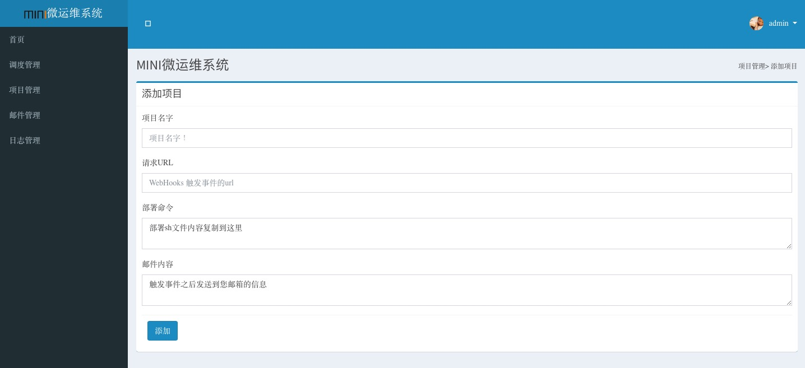

### mini
`mini` 希望做一个非常mini 的devops 的服务器，它解决了`webhook` 到`部署`之间的部署问题

### 所做工作
github、gitlab 等代码托管平台都有 `webhooks` 功能，当pull 代码或者其他的一些事件时
如果配置了`webhooks`那么就可以触发事件，访问一个url,我们可以借助这个url,来完成一些
拉取代码、编译部署等步骤，直到完成生产部署

### 设计思想

#### 安全
希望可以增加一个用户和密码进行一些基本的验证

#### 通知
通知基本上用邮箱进行通知

那个部门， 那么应用， 那个url 进行了一次push

#### 日志
打印全部的编译日志，而且可以在浏览器中看到

### 一个post 包含的内容
那个部门,那个应用，url, sh文件， 邮件内容

#### 页面

#### 参与

前端页面：

在app/templates/temp/template.html 是管理模版，可以根据设计各种样式

后端设计：
语言是python ,生态是flask 和  jinja2

